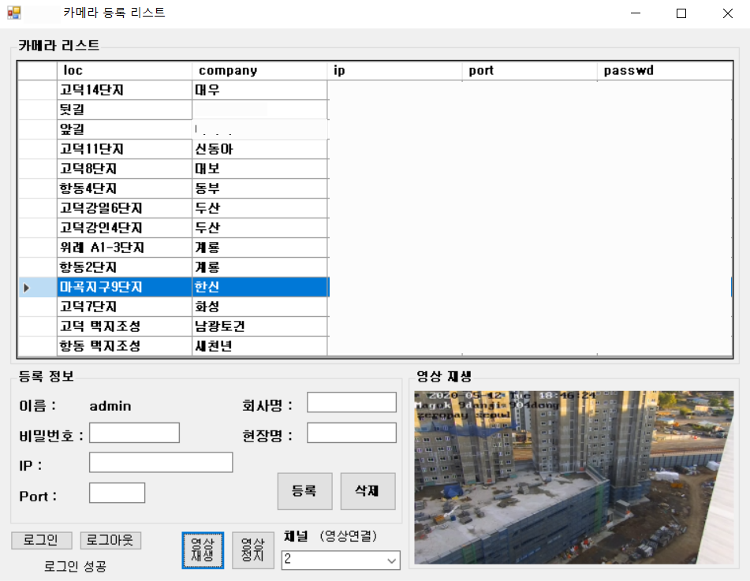

# 카메라 등록 프로그램
## 프로젝트 설명
- HIKVISION API와 WinForm을 활용하여 모든 구현을 담당하였습니다. 영상이 나오지 않는다는 문의를 받았을 때, CCTV 카메라가 활성화 중인지 인터넷 브라우저를 거치지않고 빠르게 확인하는 용도로 제작되었습니다. 설치된 카메라를 등록시켜 사용할 수 있고 등록시킨 카메라는 클릭만으로 로그인이 가능하기 때문에 영상이 나오는지 빠르게 확인할 수 있습니다.  
</img>